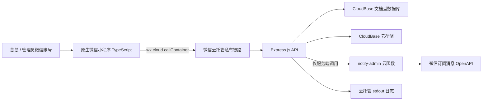

# 蔓蔓点菜：可部署微信小程序开发计划

> 文档状态：实施基线（Draft v1）  
> 编制日期：2026-08-17  
> 项目目录：`ManmanOrder`（OneDrive 同步目录）  
> 本轮范围：需求调研、架构与实施计划、测试用例、验收标准；不实施代码或云资源变更

## 1. 结论先行

“蔓蔓点菜”第一版建议采用以下最小可部署架构：

- 前端：微信原生小程序 + TypeScript，不引入 Taro/uni-app 等跨端框架。
- 核心后端：截图中已有的 **Express.js 快速部署模板**作为起点，运行于微信云托管。
- 数据：CloudBase 文档型数据库；菜品图片使用 CloudBase 云存储。
- 调用链：小程序通过 `wx.cloud.callContainer` 访问 Express API。
- 身份：后端只读取微信云托管网关注入的 `X-WX-OPENID`，不接受客户端自报的 openid。
- 管理端：第一版直接做成小程序内仅管理员可见的“菜品管理”页面，不另建 Web 后台。
- 提醒：每次提交都生成管理员站内通知；微信外部提醒优先使用小程序订阅消息，由一个只负责通知的云函数调用微信 OpenAPI。
- 工程管理：项目继续放在 OneDrive，但 Git 历史是代码完整性与回滚依据；Windows 与 macOS 严格串行接力，不同时编辑同一工作区。

这条路径的优点是技术栈单一、部署链短、没有自建服务器运维，也便于 Codex 和 Claude Code 按统一任务编号接力。

## 2. 当前事实、假设与待确认边界

### 2.1 已核实事实

- 当前目录只有界面参考图 [`样例.jpg`](./样例.jpg)，尚无源码、测试或 Git 仓库。
- `样例.jpg` 的主要内容框架是：顶部说明、左侧菜品分类、右侧菜品列表、加菜按钮、选择篮和底部导航。
- 用户补充的控制台截图显示“免费快速部署”包含 Express.js、Spring Boot、Django、Koa、Flask 等模板。
- 本轮未读取或操作登录态控制台；技术结论来自微信/腾讯 CloudBase 官方文档和用户提供的截图。

### 2.2 本计划采用的产品假设

1. “早午饭餐”按“早餐、午餐、晚餐”三个餐次理解。若实际只需要早餐和午餐，只需删去 `dinner` 枚举及对应文案，不影响架构。
2. 第一版有两个微信账号：普通用户“蔓蔓”和管理员“我”。管理员可能也浏览菜品，但只有管理员可维护菜品。
3. 一次提交对应“一个用户 + 一个日期 + 一个餐次”，可选择多道菜。
4. 日期按 `Asia/Shanghai` 解释，业务字段保存为 `YYYY-MM-DD`，避免跨时区转换导致日期偏移。
5. 可选择今天至未来 30 天；过去日期不可新建。这个范围做成常量，确认需求后可调整。
6. 同一日期和餐次允许修改并再次提交；每次成功修改递增版本号，并产生一条新的管理员通知记录。
7. 菜品图片为可选项；没有图片时显示统一占位图，不阻塞菜品创建。
8. 第一版不做支付、库存、价格结算、评价、奖励、菜谱推荐、多人家庭、独立 Web 后台。

### 2.3 上线前必须解决的业务边界

#### 微信提醒并非无条件可用

订阅消息要求**消息接收者本人**通过 `wx.requestSubscribeMessage` 授权。个人点菜类小程序通常不能假设能取得长期订阅权限，一次性订阅一般是“一次授权对应一次可用发送机会”。因此：

- 管理员需要在小程序的“我的 → 点菜提醒”中主动授权。
- 后端记录管理员可用的授权次数；蔓蔓提交时消耗一条授权并尝试发送。
- 没有授权、管理员拒绝或微信接口失败时，点菜提交仍成功，但通知状态必须显示为“站内已记录、微信未送达”。
- 所有提交都写入管理员站内通知列表，作为可靠兜底。
- **发布门槛**：若“提醒我”必须是微信外部推送，则没有完成管理员账号真机收信前不得宣布 MVP 完成。若最终拿不到合适的订阅模板，必须由产品负责人明确选择其他提醒渠道后再继续，不能静默降级。

## 3. MVP 产品定义

### 3.1 角色与权限

| 角色 | 能力 | 明确禁止 |
|---|---|---|
| 普通用户（蔓蔓） | 浏览启用菜品；按日期/餐次选择；提交、查看和修改自己的点菜记录 | 新增/编辑/停用菜品；查看其他人的记录；查看管理员通知 |
| 管理员（我） | 普通用户全部能力；新增、编辑、启用/停用菜品；查看全部点菜通知；申请订阅提醒；手动重试失败提醒 | 通过客户端参数冒充其他 openid |

管理员身份第一版由云托管环境变量 `ADMIN_OPENIDS` 的白名单确定。openid 属于个人标识，不写入代码、文档、日志或 Git。

### 3.2 用户故事与验收结果

#### US-01 浏览菜单

作为蔓蔓，我打开小程序后能看到启用的菜品，并按分类筛选。

验收结果：首屏有明确的加载、空数据和失败状态；停用菜品不出现；切换分类不会丢失已选内容。

#### US-02 选择日期、餐次和菜品

作为蔓蔓，我能选择某一天及早餐/午餐/晚餐，并选择一道或多道菜。

验收结果：日期和餐次始终可见；已选数量清晰；过去日期和空菜品提交被阻止。

#### US-03 提交与修改点菜

作为蔓蔓，我确认后能提交；网络重试或连续点击不会生成重复记录；之后可修改同一日期餐次的选择。

验收结果：以“用户 + 日期 + 餐次”为唯一业务键；重复请求幂等；修改时使用版本号避免覆盖较新的数据。

#### US-04 收到提醒

作为管理员，蔓蔓成功提交或修改后，我能在站内通知列表看到它；有可用订阅授权时还能收到微信服务通知。

验收结果：数据库通知记录必达；外部消息记录 `sent`、`no_quota`、`rejected` 或 `failed`，不能把失败伪装为成功。

#### US-05 管理菜品

作为管理员，我能新增菜品，修改名称、分类、说明、图片和排序，并启用或停用菜品。

验收结果：权限由后端强制执行；停用不删除历史点菜记录中的菜品快照；普通用户调用管理 API 得到 403。

## 4. 界面与信息架构

### 4.1 视觉方向

参考 `样例.jpg` 的内容框架，但不复刻其中人物、猫咪或其他可能有权属的素材：

- 整体：暖白背景、鼠尾草绿为主色、浅粉作选中/提醒色，圆角卡片和轻阴影。
- 顶部：应用名“蔓蔓点菜”、简短提示、日期选择器和餐次分段控件。
- 内容区：左侧窄分类栏，右侧菜品卡片；卡片含图片、名称、简短说明和加/减按钮。
- 底部：固定选择篮摘要和主操作按钮；适配安全区。
- 底部导航：`点菜`、`记录`、`我的`；管理员在“我的”内看到“菜品管理”和“通知记录”。
- 不使用星级、月销、价格等当前需求没有的数据，避免做成餐厅商城。

### 4.2 页面清单

| 页面 | 路径建议 | 核心状态 |
|---|---|---|
| 点菜首页 | `pages/menu/index` | 日期、餐次、分类、菜品、当前选择 |
| 提交确认 | `pages/selection/confirm` | 已选菜品、备注（可选）、提交状态 |
| 点菜记录 | `pages/meal-plans/index` | 按日期展示本人记录、修改入口 |
| 我的 | `pages/profile/index` | 当前角色、提醒授权入口、管理入口 |
| 菜品管理 | `pages/admin/dishes/index` | 搜索、启停、编辑、新增 |
| 菜品编辑 | `pages/admin/dish-edit/index` | 表单、图片上传、校验、保存 |
| 通知记录 | `pages/admin/notifications/index` | 提交内容、外部送达状态、重试入口 |

### 4.3 关键交互

1. 首页默认今天和最近一次使用的餐次；初次使用按当前时间建议餐次，但用户可手动切换。
2. 切换日期/餐次前若存在未提交修改，弹出“保留并切换 / 取消”确认，不静默丢失。
3. 提交按钮显示当前已选数量；请求期间禁用，避免重复点击。
4. 提交成功页明确区分“点菜已保存”和“微信提醒是否送达”。
5. 管理员停用菜品使用二次确认；第一版不提供不可恢复的物理删除。
6. 所有触控目标最小 44 × 44 CSS 像素，文本在 320、375、430 CSS 像素宽度无横向溢出。

## 5. 技术架构



### 5.1 为什么选择原生小程序 + TypeScript

- 当前只要求微信小程序，不需要跨端框架的构建层。
- 可以直接使用 `wx.cloud`、订阅消息、云存储和微信开发者工具。
- TypeScript 能为 API DTO、日期/餐次枚举和组件属性提供静态约束。
- 依赖和构建步骤少，Windows 与 macOS 更容易复现。

### 5.2 为什么选择 Express.js 云托管

- 用户截图确认快速部署页已有 Express.js 模板。
- 前后端语言统一，适合小项目和两个编码 Agent 串行交接。
- 官方云托管支持容器、源码、Git 与 CLI 等部署方式；后续代码由仓库中的 Dockerfile 决定，不把控制台模板当作唯一源码。
- 服务只需实现少量 REST API，不需要 NestJS 等更重框架。

### 5.3 为什么选择文档型数据库

- 当前数据量小，菜品和点菜记录天然适合 JSON 文档。
- 无需管理 MySQL 实例、连接池和迁移服务，MVP 部署更短。
- 点菜记录保存菜品快照后，可在单文档内完成主要读写。
- 服务端 SDK 支持事务；需要同时写点菜记录和通知任务时使用事务保证一致性。

### 5.4 暂不采用的方案

| 方案 | 暂不采用原因 | 何时再考虑 |
|---|---|---|
| 小程序直接读写数据库 | 管理员权限、幂等、通知和审计逻辑会散落前端 | 纯只读公共目录可局部采用 |
| MySQL | 当前没有复杂联表、报表或高并发需求；增加实例和迁移成本 | 多家庭、多租户、复杂统计时 |
| 独立 Web 管理后台 | 重复建设登录与部署面，超出当前需求 | 管理员需要电脑批量管理时 |
| Taro/uni-app | 当前无跨端目标，增加构建与调试层 | 明确要同时发布 H5/其他平台时 |
| 直接在 Express 中保存文件 | 云托管容器必须无状态，本地文件不可作持久存储 | 不采用 |

## 6. 建议仓库结构

```text
ManmanOrder/
├── AGENTS.md                         # Codex/通用 Agent 规则
├── CLAUDE.md                         # Claude Code 入口，引用同一规则与计划
├── README.md                         # 安装、启动、验证、部署入口
├── DEVELOPMENT_PLAN.md               # 本文档
├── TASKS.md                          # 带任务编号和状态的唯一任务清单
├── HANDOFF.md                        # 追加式交接记录
├── DECISIONS.md                      # 简短 ADR/决策记录
├── .editorconfig
├── .gitattributes
├── .gitignore
├── .node-version                     # 固定 Node.js 22 大版本
├── miniprogram/
│   ├── package.json
│   ├── package-lock.json
│   ├── project.config.json           # 可提交的公共配置；不含私钥
│   ├── project.private.config.json   # 本机配置，必须忽略
│   ├── miniprogram/
│   │   ├── app.ts
│   │   ├── app.json
│   │   ├── app.wxss
│   │   ├── pages/
│   │   ├── components/
│   │   ├── services/                 # callContainer 封装与 DTO
│   │   ├── domain/                   # 日期、餐次、选择逻辑（纯函数）
│   │   └── assets/
│   └── tests/
├── server/
│   ├── package.json
│   ├── package-lock.json
│   ├── Dockerfile
│   ├── .dockerignore
│   ├── src/
│   │   ├── app.ts                    # Express app，不直接 listen，便于测试
│   │   ├── index.ts                  # 读取 PORT 并启动
│   │   ├── routes/
│   │   ├── middleware/
│   │   ├── repositories/
│   │   ├── services/
│   │   └── schemas/
│   └── tests/
├── cloudfunctions/
│   └── notify-admin/                 # 仅服务端可调用的订阅消息适配器
├── docs/
│   ├── api/openapi.yaml              # API 契约真源
│   ├── data-model.md
│   ├── release-checklist.md
│   └── test-evidence/                 # 不含账号、openid 或密钥
├── fixtures/                          # 脱敏测试数据
└── scripts/
    ├── verify.mjs                     # 跨平台总验证入口
    ├── check-no-secrets.mjs
    └── smoke-cloudrun.mjs
```

不依赖 Bash 专属脚本；所有通用脚本使用 Node.js `.mjs`，保证 PowerShell 和 zsh 都可执行。

## 7. 数据模型

### 7.1 `dishes`

| 字段 | 类型 | 规则 |
|---|---|---|
| `_id` | string | 服务端生成，不复用 |
| `name` | string | 必填，1–30 字；去首尾空格 |
| `category` | enum | `breakfast`、`hot`、`cold`、`soup`、`staple`、`dessert` |
| `description` | string | 可选，最多 100 字 |
| `imageFileId` | string/null | CloudBase 文件 ID；可空 |
| `isActive` | boolean | 默认 `true`；停用代替删除 |
| `sortOrder` | integer | 默认 0，升序展示 |
| `createdAt` / `updatedAt` | server timestamp | 只由服务端写 |
| `createdBy` / `updatedBy` | string | 管理员 openid；API 不直接回传 |

索引：`{ isActive: 1, category: 1, sortOrder: 1 }`。

### 7.2 `meal_plans`

| 字段 | 类型 | 规则 |
|---|---|---|
| `_id` | string | `sha256(openid + date + mealType)` 的服务端确定性 ID，避免重复 |
| `ownerOpenid` | string | 从 `X-WX-OPENID` 获取，不接受请求体传入 |
| `date` | string | `YYYY-MM-DD`，按上海时区校验 |
| `mealType` | enum | `breakfast`、`lunch`、`dinner` |
| `items` | array | 1–20 项；含 `dishId`、`nameSnapshot`、`imageSnapshot` |
| `note` | string | 可选，最多 100 字 |
| `version` | integer | 首次为 1；修改时 +1，用于乐观锁 |
| `createdAt` / `updatedAt` | server timestamp | 只由服务端写 |

查询索引：`{ ownerOpenid: 1, date: -1 }`。API 返回时不返回 `ownerOpenid` 原值。

### 7.3 `notification_jobs`

| 字段 | 类型 | 规则 |
|---|---|---|
| `_id` | string | 服务端生成 |
| `mealPlanId` / `mealPlanVersion` | string/integer | 唯一关联一次提交或修改 |
| `recipientOpenid` | string | 从管理员白名单选择 |
| `channel` | enum | `in_app`、`wechat_subscribe` |
| `status` | enum | `pending`、`sent`、`no_quota`、`rejected`、`failed` |
| `attemptCount` | integer | 初始 0；每次尝试递增 |
| `lastErrorCode` | string/null | 只保存非敏感错误码，不保存 access token |
| `createdAt` / `sentAt` | timestamp | 服务端时间 |

唯一索引：`{ mealPlanId: 1, mealPlanVersion: 1, channel: 1 }`，防止重复发消息。

### 7.4 `notification_subscriptions`

记录管理员主动授权的一次性订阅额度：`recipientOpenid`、`templateId`、`remainingQuota`、`acceptedAt`、`consumedAt`。发送成功才扣减；拒绝或发送失败不伪造为已送达。实际额度仍以微信接口返回为准。

### 7.5 一致性规则

- 新增/更新 `meal_plans` 与创建两条通知任务在一次数据库事务内完成。
- 外部微信调用不得放进数据库事务；事务提交后再发送，并回写结果。
- 菜品编辑不修改历史 `items` 快照。
- 修改点菜必须提交客户端最后读取的 `version`；不一致返回 409 `VERSION_CONFLICT`。

## 8. API 契约草案

所有业务接口前缀为 `/api/v1`，响应统一为：

```json
{
  "data": {},
  "requestId": "gateway-request-id"
}
```

错误统一为：

```json
{
  "error": {
    "code": "VALIDATION_ERROR",
    "message": "可展示给用户的简短信息",
    "fields": {}
  },
  "requestId": "gateway-request-id"
}
```

| 方法与路径 | 角色 | 作用 | 关键状态码 |
|---|---|---|---|
| `GET /health` | 平台 | 存活检查，不访问隐私数据 | 200/503 |
| `GET /api/v1/me` | 登录用户 | 返回 `user` 或 `admin` 角色 | 200/401 |
| `GET /api/v1/dishes` | 登录用户 | 读取启用菜品，可按分类筛选 | 200/400 |
| `GET /api/v1/meal-plans?from=&to=` | 登录用户 | 只读取自己的点菜记录 | 200/400 |
| `POST /api/v1/meal-plans` | 登录用户 | 首次提交；要求 `Idempotency-Key` | 201/400/409 |
| `PUT /api/v1/meal-plans/{id}` | 记录所有者 | 带 `version` 修改 | 200/403/404/409 |
| `GET /api/v1/admin/dishes` | 管理员 | 包含停用菜品 | 200/403 |
| `POST /api/v1/admin/dishes` | 管理员 | 新增菜品 | 201/400/403 |
| `PATCH /api/v1/admin/dishes/{id}` | 管理员 | 编辑或启停 | 200/400/403/404 |
| `GET /api/v1/admin/notifications` | 管理员 | 查看站内通知与送达状态 | 200/403 |
| `POST /api/v1/admin/subscriptions` | 管理员 | 记录用户点击后取得的订阅结果 | 201/400/403 |
| `POST /api/v1/admin/notifications/{id}/retry` | 管理员 | 手动重试可重试通知 | 202/403/409 |

### API 强制规则

- 缺少有效 `X-WX-OPENID` 返回 401。
- `X-WX-OPENID` 只从受信网关注入；生产环境关闭公网入口。
- 所有写入使用 schema 校验；未知字段默认拒绝。
- `Idempotency-Key` 相同且请求体相同时返回同一结果；相同 key 不同请求体返回 409。
- 请求日志只记录 requestId、路由、状态码、耗时和 openid 的不可逆短哈希，不记录原始 openid、请求正文、密钥或订阅模板数据。
- API 契约写入 `docs/api/openapi.yaml`，前后端修改同一接口时必须先更新契约和契约测试。

## 9. 提醒功能实施方案

### 9.1 正常路径

1. 管理员在“我的 → 点菜提醒”点击“开启下一次提醒”。
2. 点击事件同步调用 `wx.requestSubscribeMessage`；仅在返回 `accept` 后通知后端新增一条可用授权记录。
3. 蔓蔓提交点菜，Express 在事务内写入 `meal_plans` 和通知任务。
4. Express 以 `notificationJobId` 调用 `notify-admin` 云函数。
5. 云函数只接受服务端调用，读取通知任务和订阅额度，调用 `cloud.openapi.subscribeMessage.send`。
6. 发送成功后扣减额度并把任务标为 `sent`；失败则记录明确状态和可重试错误码。
7. 无论微信消息是否送达，管理员站内通知都可见。

### 9.2 Phase 0 可行性闸门

在开发完整页面前，用最小原型验证：

- 公众平台能为当前小程序类目配置合适的订阅消息模板。
- 管理员真机点击后能返回 `accept`。
- 云函数能向管理员账号发送一条开发版/体验版订阅消息。
- 消息点击后能跳回小程序指定页面。
- 消耗一次授权后，第二次发送能被识别为无额度，而不是误报成功。

任一项失败，记录微信错误码和类目限制；先决定替代提醒渠道，再继续完整通知开发。

### 9.3 不接受的实现

- 不使用蔓蔓的订阅授权给管理员发消息；授权与接收者 openid 必须一致。
- 不在仓库中保存 AppSecret、CI 私钥、access token 或真实 openid。
- 不把前端返回的 `accept` 当成最终送达证据；最终证据是管理员真机收到消息并能跳转。
- 不因为通知发送失败而回滚已成功保存的点菜记录。

## 10. 跨 Windows 10 / macOS 开发与 Agent 接力

### 10.1 工具基线

两台电脑统一安装：

- Git（统一 `core.autocrlf=false`，仓库通过 `.gitattributes` 固定文本为 LF）。
- Node.js 22.x 与 npm；以 `.node-version` 和 `package.json#engines` 为准。
- 微信开发者工具稳定版。
- Docker Desktop（用于部署前的容器一致性验证）。
- OneDrive 客户端；项目目录设置为“始终保留在此设备”。

任何机器第一次接手都执行 `npm ci`，不跨系统同步 `node_modules`、构建产物、日志或本机私有配置。

### 10.2 OneDrive 与 Git 的职责

- OneDrive：满足项目云盘保存与设备间文件接续；也保存参考图片和非敏感测试证据。
- Git：记录变更边界、审查、回滚和 Agent 交接；建议配置一个私有远端作为额外恢复点。
- 禁止 Windows 与 Mac 同时打开并编辑这个同步目录。
- `.git` 若由 OneDrive 同步，必须等 OneDrive 完成后再切换设备；发生同步冲突时暂停开发，先比较 Git HEAD、文件清单和哈希，不能盲目覆盖。

### 10.3 设备切换协议

离开当前设备前：

1. 关闭微信开发者工具及正在写文件的 Agent。
2. 运行 `npm run verify` 并把结果写入 `HANDOFF.md`。
3. 确认 `git status --short`；有意变更必须形成可审查提交，临时文件不得交接。
4. 记录当前分支、提交 SHA、任务编号、未解决问题和下一条命令。
5. 等待 OneDrive 显示同步完成。

在另一台设备接手：

1. 等待 OneDrive 同步完成，先不要打开 IDE。
2. 核对 `git status --short` 和 `git rev-parse HEAD` 与交接记录一致。
3. 执行 `npm ci`、`npm run verify`。
4. 只有基线通过后才继续当前任务；不通过先标记为 `BLOCKED` 并诊断差异。

### 10.4 Codex / Claude Code 交接协议

- `TASKS.md` 是唯一任务状态源，每个任务格式为 `T-###`，一次只允许一个 `IN_PROGRESS`。
- 每次 Agent 开始前必须读取：`AGENTS.md`、`CLAUDE.md`、`DEVELOPMENT_PLAN.md`、`TASKS.md`、`HANDOFF.md` 最后一条。
- Codex 与 Claude Code 不同时修改同一工作区；一个任务未交接前，另一个不开始。
- 每个任务只做验收标准要求的文件，不顺手重构相邻代码。
- 接口、数据模型或安全边界改变时，必须先更新 `DECISIONS.md` 与 OpenAPI，再改实现。
- 每次交接记录：目标、实际改动文件、测试命令及结果、未完成项、风险、下一步、提交 SHA。
- 任何 Agent 都不得自动提交密钥，不得未经用户授权部署、发布、创建 PR 或把小程序提交审核。

建议的 `HANDOFF.md` 模板：

```markdown
## YYYY-MM-DD HH:mm - T-### - Codex/Claude

- 状态：DONE / BLOCKED / PARTIAL
- 目标：
- 改动文件：
- 验证命令与结果：
- 未解决风险：
- 下一步：
- Git：branch / commit SHA / clean-or-dirty
```

## 11. 分阶段实施计划

工作量是单人串行开发的粗略估算，用于排序而非承诺日期。

### M0：需求冻结与通知可行性（0.5–1.5 天）

任务：

- `T-001` 确认餐次、可选日期范围、是否允许修改、管理员账号和第一批菜品。
- `T-002` 注册/确认小程序 AppID、CloudBase 环境和服务名称；不在仓库写真实值。
- `T-003` 完成订阅模板申请与双账号最小真机发送原型。
- `T-004` 把最终决定写入 `DECISIONS.md`，把通知结果写入脱敏测试证据。

出口标准：

- 所有 2.2 假设已确认或被替换。
- 通知真机测试成功；若失败，替代渠道已经由产品负责人明确批准。
- 尚未通过时，后续 UI 可开发，但“可发布”状态保持阻塞。

### M1：工程骨架与本地可复现（1–1.5 天）

任务：

- `T-010` 初始化 Git、根文档、`.gitignore`、`.gitattributes` 和 Node 版本约束。
- `T-011` 初始化原生 TypeScript 小程序，建立 `callContainer` 客户端封装。
- `T-012` 从 Express 快速模板建立后端，拆分 `app.ts` 与 `index.ts`，实现 `/health`。
- `T-013` 增加 Dockerfile、`.dockerignore`、测试和跨平台 `scripts/verify.mjs`。
- `T-014` 创建 OpenAPI 骨架、统一响应格式、错误处理中间件和 requestId。

出口标准：

- Windows 10 和 macOS 均能从干净依赖执行 `npm ci` 与 `npm run verify`。
- Docker 镜像构建成功，容器监听 `PORT`/配置端口并通过 `/health`。
- 日志和构建产物没有密钥、原始 openid 或本机绝对路径。

### M2：身份、菜品与管理员功能（2–3 天）

任务：

- `T-020` 实现微信请求身份中间件和管理员白名单。
- `T-021` 建立 `dishes` 集合、索引、仓储层和脱敏种子数据。
- `T-022` 实现菜品查询、新增、编辑、启停 API 与契约测试。
- `T-023` 实现菜单浏览 UI、分类栏、菜品卡和空/错/加载状态。
- `T-024` 实现管理员菜品列表和编辑表单；最后接图片上传。

出口标准：

- 普通用户能读取启用菜品但管理请求全部 403。
- 管理员新增或修改后，普通用户刷新可见；停用菜品从新菜单消失。
- 历史 fixture 不因菜品改名/停用而改变。

### M3：点菜主流程（2–3 天）

任务：

- `T-030` 实现日期、餐次、选择篮纯函数和单元测试。
- `T-031` 建立 `meal_plans`、确定性 ID、事务与索引。
- `T-032` 实现首次提交、幂等、查询、版本冲突和修改 API。
- `T-033` 实现首页选择、确认页、成功/失败反馈和点菜记录页。
- `T-034` 增加断网、重试、双击、旧版本覆盖等集成与 E2E 用例。

出口标准：

- 双击或网络重试只产生一条对应版本记录。
- 不同日期/餐次互不覆盖；只能读取和修改自己的记录。
- 真实设备完成“选择 → 提交 → 查看 → 修改”闭环。

### M4：提醒闭环（1–2 天，依赖 M0）

任务：

- `T-040` 建立订阅额度和通知任务集合、唯一索引与事务写入。
- `T-041` 实现管理员主动授权页面和后端记录。
- `T-042` 实现 `notify-admin` 云函数、权限限制、状态回写和错误映射。
- `T-043` 实现管理员站内通知列表和失败重试。
- `T-044` 在开发版、体验版分别完成双账号真机测试。

出口标准：

- 点菜提交成功后站内通知必定可查。
- 有额度时管理员在 2 分钟内收到微信通知，点击进入正确记录。
- 无额度、拒绝、字段错误和网络失败都有准确状态，不影响点菜保存。
- 相同 `mealPlanId + version + channel` 不重复发送。

### M5：体验、可靠性与发布准备（1.5–2.5 天）

任务：

- `T-050` 按样例内容框架统一色彩、间距、圆角、图像比例和安全区。
- `T-051` 做 320/375/430 宽度、iOS/Android 真机和弱网检查。
- `T-052` 完成日志脱敏、请求限流、上传类型/大小限制和无密钥扫描。
- `T-053` 在云托管开发/测试环境完成 Docker 部署、日志、健康和回滚演练。
- `T-054` 完成体验版回归、隐私说明、用户授权文案与发布清单。

出口标准：

- 第 12 节所有 P0/P1 测试通过，无开放的 P0/P1 缺陷。
- 生产服务关闭公网访问后，小程序仍能通过 `callContainer` 正常使用。
- 旧版本可恢复，数据库数据不因回滚丢失。
- 最终发布仍由用户在微信公众平台手工确认，不由 Agent 自动执行。

## 12. 测试用例与通过标准

### 12.1 自动化层级

- 纯逻辑单元测试：Vitest；覆盖日期、餐次、选择篮、幂等键、权限和 schema。
- API 测试：Supertest 对 Express `app` 进行契约和鉴权测试；仓储使用可控 fake。
- CloudBase 集成测试：专用开发环境验证数据库事务、索引、云存储和云函数；不得指向生产集合。
- 小程序组件测试：微信官方 `miniprogram-simulate` 或当前官方推荐组件测试方案。
- 小程序 E2E：微信开发者工具 + `miniprogram-automator`；CLI 路径由本机环境变量提供，不写死 Mac/Windows 路径。
- 容器测试：本地 Docker 构建、启动、健康检查、无状态检查。
- 真机测试：蔓蔓账号与管理员账号两台/两个微信账号完成通知闭环。

### 12.2 详细测试矩阵

| ID | 优先级 | 场景与步骤 | 通过标准 |
|---|---|---|---|
| F-001 | P0 | 普通用户打开菜单 | 只返回 `isActive=true` 菜品；分类与排序正确 |
| F-002 | P1 | 菜品为空 | 显示空状态和管理员添加提示，不白屏 |
| F-003 | P0 | 选择今天/未来 30 天 | 可正常选择；页面和请求日期一致 |
| F-004 | P0 | 选择过去或超过范围日期 | 前端阻止；绕过前端请求时 API 返回 400 |
| F-005 | P0 | 切换早餐/午餐/晚餐 | 三个选择篮隔离，不串菜 |
| F-006 | P0 | 选择多道菜并取消一道 | 数量、列表和提交体同步更新 |
| F-007 | P0 | 空选择提交 | 无请求或 API 400；提示明确 |
| F-008 | P0 | 首次正常提交 | 201；生成一条 `meal_plan` v1 和唯一通知任务 |
| F-009 | P0 | 500 ms 内连续点击提交 | 按钮锁定；数据库仅一条 v1 |
| F-010 | P0 | 相同幂等键重放相同请求 | 返回原结果，不新增记录或通知 |
| F-011 | P0 | 相同幂等键发送不同请求体 | 409 `IDEMPOTENCY_CONFLICT` |
| F-012 | P0 | 使用当前 version 修改 | 保存新选择，version +1，创建新版本通知 |
| F-013 | P0 | 使用过期 version 修改 | 409 `VERSION_CONFLICT`，较新数据不被覆盖 |
| F-014 | P0 | 用户读取另一个 openid 的记录 | 后端不接受目标 openid 参数；无法读取 |
| A-001 | P0 | 普通用户调用新增/编辑/停用 API | 全部 403，数据库无变化 |
| A-002 | P0 | 管理员新增合法菜品 | 201；普通用户刷新后可见 |
| A-003 | P1 | 名称为空、超长或未知分类 | 400，返回字段级错误，不产生脏数据 |
| A-004 | P0 | 管理员改名并停用菜品 | 新菜单不显示；历史点菜快照仍显示旧名称 |
| A-005 | P1 | 上传错误类型或超限图片 | 客户端提示；服务端/存储规则拒绝 |
| N-001 | P0 | 管理员由真实点击触发订阅 | 微信弹窗出现；`accept/reject` 被正确区分 |
| N-002 | P0 | 有可用授权后蔓蔓提交 | 2 分钟内管理员真机收到，点击跳到正确记录 |
| N-003 | P0 | 没有可用授权 | 点菜仍成功；站内可见；状态 `no_quota` |
| N-004 | P1 | 管理员拒绝订阅 | 不重复骚扰弹窗；显示如何重新开启 |
| N-005 | P0 | 相同通知任务被重试 | 最多一次成功发送；不会双扣额度 |
| N-006 | P1 | 微信字段不合规/模板失效 | 状态 `failed` 和脱敏错误码可查；可修复后重试 |
| S-001 | P0 | 请求缺少网关注入身份 | 401，且日志不输出请求正文 |
| S-002 | P0 | 请求体伪造 `openid/admin=true` | 字段被拒绝；权限仍由真实头和白名单决定 |
| S-003 | P0 | 生产公网关闭 | 公网不可访问；已关联小程序 `callContainer` 正常 |
| S-004 | P0 | 仓库扫描密钥模式 | 无 AppSecret、CI 私钥、token、真实 openid |
| S-005 | P1 | 超长文本、未知字段、脚本字符串 | 400 或按纯文本展示；无注入、无执行 |
| U-001 | P1 | 320/375/430 宽度检查 | 无横向滚动、遮挡、文本溢出；底部按钮不盖内容 |
| U-002 | P1 | 加载/空/错误/重试四状态 | 每种状态有可理解文案和可操作入口 |
| U-003 | P1 | iOS/Android 真机触控 | 主要按钮单手可达；点击区域至少 44×44 |
| X-001 | P0 | macOS 从干净工作区安装验证 | `npm ci`、`npm run verify` 全部退出码 0 |
| X-002 | P0 | Windows 10 从干净工作区安装验证 | 同上；无 Bash、路径分隔符或大小写错误 |
| D-001 | P0 | Docker 使用平台 `PORT` 启动 | 监听 `0.0.0.0`；配置端口健康检查通过 |
| D-002 | P0 | 容器重启/扩缩容 | 数据仍在数据库/存储；本地磁盘无业务依赖 |
| D-003 | P1 | 云托管日志观察 | 能按 requestId 定位；无密钥、openid 原值或正文 |
| P-001 | P1 | 20 个菜品、连续切换分类 | 交互无明显卡顿；重复请求有加载锁 |
| P-002 | P1 | 10 并发提交不同餐次 fixture | 无重复键异常泄漏；所有结果可解释 |

### 12.3 覆盖率与质量门槛

- 后端语句/分支覆盖率：核心 `middleware`、`services`、`schemas` 不低于 90%；项目总体不低于 80%。
- 小程序 `domain` 与 `services`：语句/分支不低于 90%；纯样式和框架胶水不强求数字。
- 所有 P0、P1 用例通过；P2 缺陷可记录但不得影响核心路径、安全或数据一致性。
- `npm run verify` 至少包含：格式检查、lint、类型检查、单元/API 测试、覆盖率门槛、构建、无密钥扫描。
- 自动化测试通过不替代双账号真机通知、体验版和生产私有链路验证。

## 13. 部署路径

### 13.1 一次性云资源准备（人工确认）

1. 创建/确认小程序 AppID，并与 CloudBase 环境关联。
2. 以截图中的 Express.js 快速模板创建云托管服务；服务名创建后不可随意改变。
3. 创建开发环境；正式上线前再建生产环境，禁止开发测试共用生产集合。
4. 创建文档数据库集合、索引和云存储目录。
5. 配置通知云函数与订阅消息模板。
6. 在服务环境变量中配置环境 ID、服务名、管理员白名单、模板 ID 等；真实值不进入仓库。

### 13.2 可复现部署（推荐）

- 快速模板只用于首次创建资源；后续以仓库 `server/Dockerfile` 为真源。
- 本地先运行容器测试，再使用 CloudBase CLI `tcb cloudrun deploy --port <PORT>` 或受控 Git 部署。
- 开发环境验证后创建新版本；先检查构建日志、健康检查和业务 smoke，再切流量。
- 生产环境默认关闭公网，只允许小程序通过 `callContainer` 私有链路访问。
- 发布后检查 stdout 日志、请求错误率和通知失败状态；有异常切回上一版本。

### 13.3 小程序发布

1. 开发者工具本地编译和自动化测试。
2. 真机开发版验证。
3. 上传体验版，双账号完整回归。
4. 核对隐私说明、订阅消息用途、权限和类目。
5. 用户手工确认后提交微信审核。
6. 审核通过后由用户手工发布；Agent 不自动执行最终发布。

## 14. 安全、隐私与配置清单

- `.gitignore` 必须覆盖 `.env*`、`project.private.config.json`、`*.key`、`node_modules/`、`miniprogram_npm/`、`dist/`、日志和本机缓存。
- 只提交 `.env.example`，值全部为明显占位符。
- 云托管环境变量和小程序 CI 私钥不保存在 OneDrive 项目目录。
- 服务端不返回或记录原始 openid；管理员白名单只在运行环境中存在。
- 生产公网关闭；开发时临时开启必须在发布清单中关闭。
- 菜品图片限制 MIME、扩展名和大小；随机文件名，不使用用户输入拼接路径。
- 点菜备注按纯文本展示，限制长度；不渲染富文本/HTML。
- 依赖锁文件必须提交；依赖升级单独任务处理，不与业务功能混做。
- 备份策略在上线前验证：导出菜品和点菜记录的脱敏样本，并演练恢复到开发环境。

## 15. 最终 Definition of Done

只有同时满足以下条件，才可称“蔓蔓点菜 MVP 已完成”：

- 蔓蔓账号能在真实手机选择日期、餐次、多道菜，提交、查看并修改。
- 管理员账号能新增、编辑、启停菜品，普通账号无法绕过后端权限。
- 每次提交都能在管理员站内通知看到；若外部提醒属于必需，管理员真机在 2 分钟内收到微信订阅消息并正确跳转。
- 双击、重试和旧版本修改不会产生重复数据或覆盖新数据。
- Windows 10 和 macOS 各从干净依赖执行完整验证，结果均为退出码 0。
- Docker 镜像在本地和云托管健康检查通过；容器重启不丢业务数据。
- 生产公网关闭后，正式/体验版小程序仍能通过 `callContainer` 使用全部核心 API。
- 无 P0/P1 缺陷；日志、仓库和测试证据不含真实密钥、token、openid 或敏感请求正文。
- `README.md`、OpenAPI、数据模型、发布清单、测试证据和最新 `HANDOFF.md` 与实现一致。
- 最终微信审核与发布由用户确认完成。

## 16. 开发前需要用户确认的最小清单

1. 餐次到底是“早餐、午餐、晚餐”还是只有“早餐、午餐”。
2. 点菜提交后是否允许修改；本计划默认允许。
3. 允许选择的日期范围；本计划默认今天至未来 30 天。
4. 管理员和蔓蔓是否为两个不同微信账号；真机通知验收需要明确接收账号。
5. “提醒我”是否必须是微信外部消息；若订阅模板受限，是否接受其他明确指定的渠道。
6. 第一批菜品名称、分类和图片；没有图片可先用占位图。
7. 小程序主体类型、AppID、CloudBase 环境是否已创建；这些真实值只配置在本机/云环境，不贴入对话或仓库。

## 17. 官方资料依据（访问于 2026-08-17）

- [CloudBase：微信小程序访问云托管服务](https://docs.cloudbase.net/run/develop/access/mini)：`wx.cloud.callContainer`、环境关联、私有链路与公网关闭建议。
- [CloudBase：云托管概述](https://docs.cloudbase.net/run/introduction)：容器化、部署方式、扩缩容与适用场景。
- [CloudBase：服务开发说明](https://docs.cloudbase.net/run/develop/developing-guide)：监听 `PORT`、无状态服务和镜像要求。
- [CloudBase：Node.js 快速开始](https://docs.cloudbase.net/run/quick-start/dockerize-node)：Node.js/Dockerfile/CLI 部署路径。
- [CloudBase：从源代码部署](https://docs.cloudbase.net/run/deploy/deploy/deploying-source-code)：源码包、Dockerfile 和端口配置。
- [CloudBase：服务设置](https://docs.cloudbase.net/run/deploy/service-setting)：环境变量、日志、公网与小程序私有链路。
- [CloudBase：云托管与身份认证](https://docs.cloudbase.net/faq/knowledge/cloudrun-authentication-integration)：`X-WX-OPENID` 等网关注入身份头。
- [CloudBase：文档型数据库](https://docs.cloudbase.net/database/introduce)：数据模型、权限、索引和事务能力。
- [CloudBase：事务操作](https://docs.cloudbase.net/database/transaction)：服务端 Node SDK 事务与限制。
- [CloudBase：基础权限](https://docs.cloudbase.net/database/data-permission)：文档数据权限模式。
- [CloudBase：用云函数给微信小程序发订阅消息](https://docs.cloudbase.net/recipes/add-subscribe-message-cloud-function)：用户授权、一次性额度、`cloud.openapi.subscribeMessage.send` 和错误处理。
- [微信开放文档：wx.requestSubscribeMessage](https://developers.weixin.qq.com/miniprogram/dev/api/open-api/subscribe-message/wx.requestSubscribeMessage.html)：小程序端订阅授权接口。
- [微信开放文档：发送订阅消息](https://developers.weixin.qq.com/miniprogram/dev/OpenApiDoc/mp-message-management/subscribe-message/sendMessage.html)：服务端发送接口与参数。
- [微信开放文档：小程序 CI](https://developers.weixin.qq.com/miniprogram/dev/devtools/ci.html)：预览、上传与自动化构建能力。
- [微信官方 GitHub：小程序工具与示例](https://github.com/wechat-miniprogram)：官方 typings、组件测试和示例项目。

## 18. 建议的下一步

先执行 M0，不立刻铺开全部页面。特别是先用管理员和蔓蔓两个真实微信账号验证订阅消息可行性；这个结果会决定“提醒我”是正式交付能力，还是需要另选渠道。M0 通过后，再由第一个开发 Agent 建立 M1 工程骨架和 `TASKS.md`。
